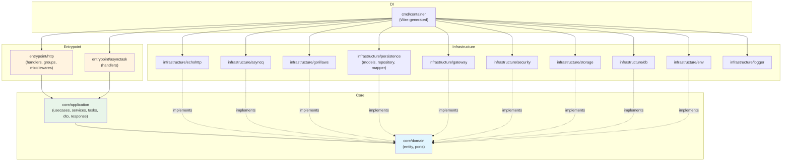
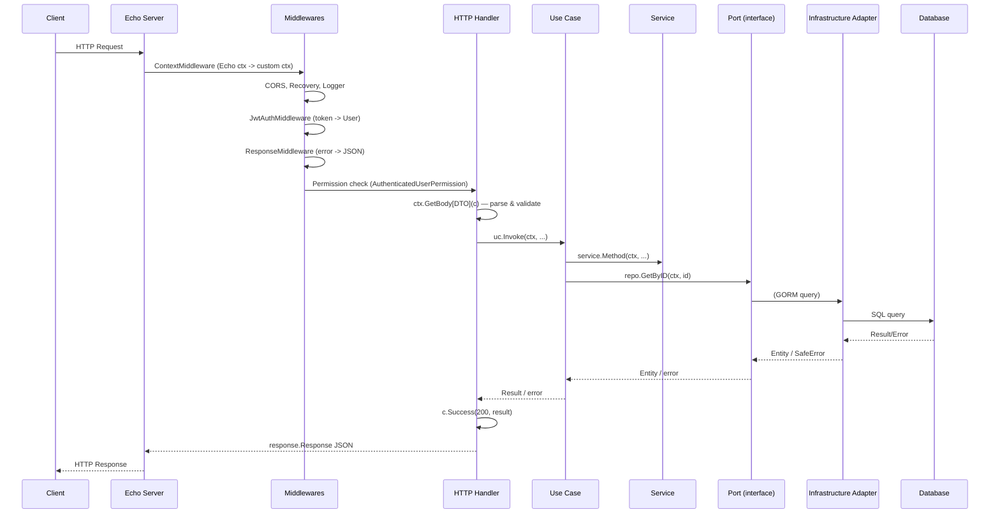
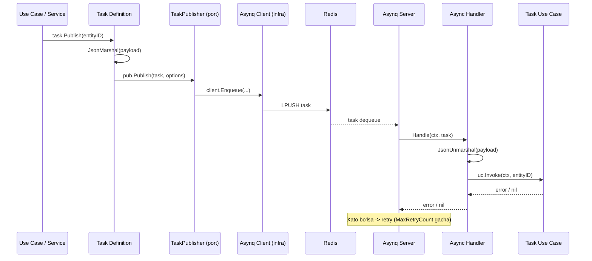
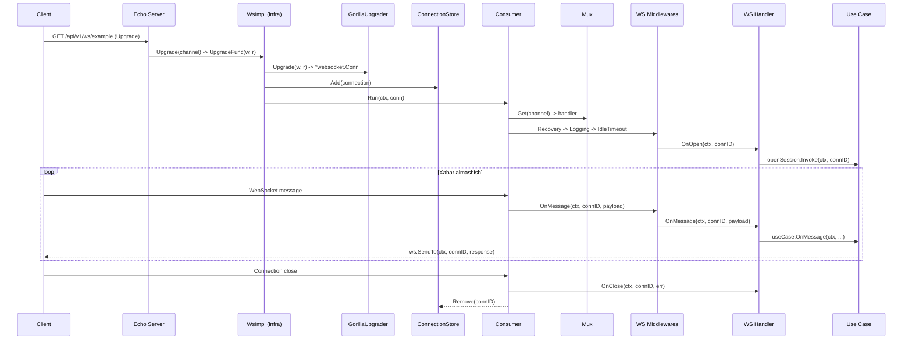

# Project Structure Documentation

Bu hujjat loyihaning arxitekturasi, katalog tuzilmasi, konvensiyalari va takrorlanadigan
pattern'larni batafsil tavsiflaydi. Yangi loyiha boshlash yoki mavjud loyihaga yangi
feature qo'shish uchun yo'riqnoma sifatida foydalanish mumkin.

---

## 1. Overview

Loyiha **Hexagonal Architecture** (Ports & Adapters) asosida qurilgan. Barcha biznes logika
`core/` ichida joylashgan bo'lib, tashqi dunyo bilan faqat **port** interfeyslari orqali
muloqot qiladi. Infrastructure adapterlari bu portlarni implement qiladi.

**Dependency rule (asosiy qoida):**

> `entrypoint -> application -> domain <- infrastructure`
>
> Core (`domain` + `application`) **hech qachon** `infrastructure` yoki `entrypoint` dan import qilmaydi.
> Infrastructure faqat domain port'lariga qarab ishlaydi.

Bu qoida `.golangci.yml` dagi `depguard` linter orqali avtomatik tekshiriladi.

---

## 2. Full Directory Tree

```
.
+-- cmd/                                    # Ilovaning kirish nuqtalari (entry points)
|   +-- http/
|   |   +-- main.go                         # HTTP server ishga tushirish
|   +-- async/
|   |   +-- main.go                         # Async task worker ishga tushirish
|   +-- container/
|       +-- container.go                    # [AUTO-GENERATED] Wire tomonidan yaratilgan DI konteyner
|
+-- src/
|   +-- core/                               # Biznes yadrosi - tashqi bog'liqliklardan xoli
|   |   +-- domain/
|   |   |   +-- entity/                     # Sof entity'lar, infrastructure importlarsiz
|   |   |   |   +-- <entity>_entity.go      # Entity strukturasi (UserEntity, EntityNameEntity, ...)
|   |   |   |   +-- enum/                   # Enum konstantalar (status, type, ...)
|   |   |   |       +-- <name>.go           # Enum type va konstantalar (EntityStatus, TokenType, ...)
|   |   |   +-- ports/                      # Faqat interfeyslar - domain + stdlib ga bog'liq
|   |   |       +-- repository/             # DB repository interfeyslari
|   |   |       |   +-- <entity>_repository.go
|   |   |       +-- gateway/                # Tashqi API gateway interfeyslari
|   |   |       |   +-- <name>_gateway.go
|   |   |       +-- security/               # Auth/crypto interfeyslari
|   |   |       |   +-- password_hasher.go
|   |   |       |   +-- jwt_token_provider.go
|   |   |       |   +-- jwt_token.go        # JWT token data struct
|   |   |       +-- unitofwork/             # Tranzaksiya abstraktsiyasi
|   |   |       |   +-- tx.go               # Tx interface{}
|   |   |       |   +-- atomic.go           # Atomic interface
|   |   |       +-- async/                  # Async task portlari
|   |   |       |   +-- task.go             # Task struct
|   |   |       |   +-- task_publisher.go   # TaskPublisher interface
|   |   |       |   +-- server.go           # AsyncServer interface
|   |   |       |   +-- handler.go          # AsyncTaskHandler interface
|   |   |       |   +-- middleware.go        # Async middleware type
|   |   |       |   +-- context.go          # AsyncContext interface
|   |   |       +-- wsport/                 # WebSocket portlari
|   |   |       |   +-- ws.go              # Ws interface (asosiy)
|   |   |       |   +-- message_handler.go  # MessageHandler interface (OnOpen/OnMessage/OnClose)
|   |   |       |   +-- middleware.go        # WS Middleware interface + Chain helper
|   |   |       |   +-- context.go          # WS Context interface
|   |   |       |   +-- conn.go            # ConnectionID type
|   |   |       |   +-- channel.go         # Channel type va konstantalar
|   |   |       +-- httpport/               # HTTP server portlari
|   |   |       |   +-- server.go           # HTTPServer interface
|   |   |       |   +-- group.go            # Group, IGroup interfeyslari
|   |   |       |   +-- handler.go          # HandlerFunc, IHandler
|   |   |       |   +-- middleware.go        # Middleware type
|   |   |       |   +-- validator.go        # Validatable interface
|   |   |       |   +-- ctx/
|   |   |       |   |   +-- context.go      # Context interface (JSON, Bind, User, ...)
|   |   |       |   |   +-- ext.go          # Helper funksiyalar (GetBody, GetIntQueryParam, ...)
|   |   |       |   +-- request/
|   |   |       |       +-- header.go       # Header interface
|   |   |       |       +-- request.go      # Request struct
|   |   |       +-- file/                   # Fayl operatsiyalari portlari
|   |   |       |   +-- pdf.go             # PdfService interface
|   |   |       |   +-- html2pdf.go        # Html2Pdf interface
|   |   |       |   +-- html_renderer.go    # HtmlRenderer interface
|   |   |       |   +-- stream.go          # Stream struct
|   |   |       +-- config/                 # Konfiguratsiya portlari
|   |   |       |   +-- config_provider.go  # ConfigProvider interface
|   |   |       +-- storage/                # Fayl saqlash portlari
|   |   |       |   +-- file_storage.go     # FileStorage interface
|   |   |       +-- payment/                # To'lov portlari
|   |   |           +-- payment_provider.go # PaymentProvider interface
|   |   |
|   |   +-- application/                    # Use case'lar va servislar
|   |   |   +-- usecases/                   # Modul bo'yicha guruhlangan use case'lar
|   |   |   |   +-- <module>usecases/       # Har bir modul uchun alohida papka
|   |   |   |       +-- <action>_usecase.go
|   |   |   +-- services/                   # Qayta ishlatiladigan servislar
|   |   |   |   +-- <name>_service.go       # (payment_service, entity_service, ...)
|   |   |   +-- tasks/                      # Async task definitsiyalari
|   |   |   |   +-- <name>_task.go          # Task publisher wrapper
|   |   |   +-- response/                   # Standart response tuzilmalari
|   |   |   |   +-- response.go             # Response struct
|   |   |   |   +-- safe_error.go           # SafeError struct
|   |   |   |   +-- code.go                 # Error/response kodlari
|   |   |   +-- dto/                        # Data Transfer Objects
|   |   |       +-- <module>_dto.go         # Request/Result struct'lari
|   |   |
|   |   +-- utils/                          # Yordamchi funksiyalar
|   |       +-- caller.go                   # CallerPath - xato joylashuvini aniqlash
|   |       +-- closer.go                   # Closer helper
|   |       +-- json.go                     # JSON marshal/unmarshal helper'lar
|   |
|   +-- entrypoint/                         # Kirish nuqtalari - handler'lar
|   |   +-- http/
|   |   |   +-- app.go                      # HTTP App - server, middleware, group'larni birlashtiradi
|   |   |   +-- groups/                     # Route group'lar
|   |   |   |   +-- <module>_group.go       # Modul routelarini ro'yxatdan o'tkazadi (entity, health, ws)
|   |   |   +-- handlers/                   # HTTP handler'lar
|   |   |   |   +-- <module>/
|   |   |   |   |   +-- <action>_handler.go # Bitta handler = bitta endpoint
|   |   |   |   +-- health/                 # Health check handler
|   |   |   |   |   +-- health_handler.go   # GET /api/v1/health
|   |   |   |   +-- ws/                     # WebSocket handler'lar
|   |   |   |       +-- <name>_ws_handler.go
|   |   |   +-- interceptor/               # Middleware'lar
|   |   |       +-- middlewares/            # HTTP middleware'lar
|   |   |       |   +-- jwt_auth_middleware.go
|   |   |       |   +-- response_middleware.go
|   |   |       +-- permissions/            # Permission tekshiruvlari
|   |   |       |   +-- authenticated_user_permission.go
|   |   |       +-- wsmiddlewares/          # WebSocket middleware'lar
|   |   +-- asynctask/
|   |       +-- app.go                      # Async App - server, handler'larni birlashtiradi
|   |       +-- handlers/                   # Async task handler'lar
|   |       |   +-- <task_name>_handler.go
|   |       +-- middleware/                 # Async middleware'lar
|   |
|   +-- infrastructure/                     # Tashqi dunyo adapterlari
|       +-- env/
|       |   +-- env.go                      # Barcha env o'zgaruvchilar (Env struct)
|       |   +-- config_adapter.go           # ConfigProvider implementatsiyasi
|       +-- db/
|       |   +-- gormdb.go                   # GORM ulanish
|       |   +-- database.go                 # Database wrapper
|       |   +-- atomic_impl.go              # unitofwork.Atomic implementatsiyasi
|       +-- persistence/
|       |   +-- models/                     # GORM modellari
|       |   |   +-- <entity>_model.go       # DB model (gorm.Model embed)
|       |   +-- repository/                 # Repository implementatsiyalari
|       |   |   +-- base_repository.go      # BaseRepository - db() va tx() helper'lar
|       |   |   +-- <entity>_repository_impl.go
|       |   +-- mapper/                     # Entity <-> Model mapper'lar
|       |       +-- <entity>_mapper.go
|       +-- gateway/                        # Tashqi API adapterlari
|       |   +-- network/                    # HTTP client va helper'lar
|       |   |   +-- http_client.go          # *http.Client provider
|       |   |   +-- chttp_client.go         # Custom HTTP client (logging bilan)
|       |   |   +-- multipart.go            # Multipart helper
|       |   |   +-- basic_auth.go           # Basic auth helper
|       |   |   +-- client_ext.go           # Client extension helper'lar
|       |   +-- <name>_gateway_impl.go      # Gateway implementatsiyalari
|       |   +-- response/                   # Gateway response struct'lari
|       |   +-- mapper/                     # Gateway mapper'lar
|       +-- echohttp/                       # Echo HTTP server implementatsiyasi
|       |   +-- server_impl.go              # HTTPServer implementatsiyasi
|       |   +-- group_impl.go              # Group implementatsiyasi
|       |   +-- context/
|       |   |   +-- echo_context.go         # ctx.Context implementatsiyasi
|       |   +-- defaults/                   # Default middleware va handler'lar
|       |   |   +-- context_middleware.go    # Echo Context -> custom Context
|       |   |   +-- request_validator.go    # Validator implementatsiyasi
|       |   |   +-- recovery_middleware.go
|       |   |   +-- http_logger_middleware.go    # HTTP request/response logging
|       |   |   +-- console_logger_middleware.go # Console output middleware
|       |   |   +-- development_group.go    # /dev route'larni ro'yxatdan o'tkazadi (docs, asynqmon)
|       |   |   +-- developer_basic_auth_middleware.go  # /dev route'lar uchun Basic Auth
|       |   |   +-- handlers/              # Dev handler'lar
|       |   |       +-- docs_handler.go     # Swagger UI handler
|       |   |       +-- asynqmon_handler.go # Asynq monitoring UI handler
|       |   +-- mapper/
|       |   |   +-- echo_mapper.go          # httpport <-> echo mapper'lar
|       |   +-- requestimpl/
|       |       +-- header.go               # Header implementatsiyasi
|       +-- asyncq/                         # Asynq (Redis task queue) implementatsiyasi
|       |   +-- asyncq.go                   # Asynq config va server provider
|       |   +-- asyncq_server.go            # AsyncServer implementatsiyasi
|       |   +-- asyncq_client.go            # Asynq client provider
|       |   +-- asyncq_task_publisher.go    # TaskPublisher implementatsiyasi
|       |   +-- context_impl.go            # AsyncContext implementatsiyasi
|       |   +-- redis_client.go            # Redis ulanish
|       |   +-- mapper/                    # Asynq mapper'lar
|       |   +-- middlewares/               # Asynq middleware'lar
|       +-- gorillaws/                      # Gorilla WebSocket implementatsiyasi
|       |   +-- ws_impl.go                 # wsport.Ws implementatsiyasi
|       |   +-- mux.go                     # Channel -> handler routing
|       |   +-- consumer.go               # Connection lifecycle (OnOpen/OnMessage/OnClose)
|       |   +-- conn.go                    # Connection struct
|       |   +-- conn_pool.go              # ConnectionStore (thread-safe)
|       |   +-- upgrader.go               # HTTP -> WS upgrade
|       |   +-- dialer.go                 # WS client dial (reconnect bilan)
|       |   +-- ws_context.go             # wsport.Context implementatsiyasi
|       |   +-- middlewares/              # WS middleware'lar (logging, recovery)
|       +-- security/                      # Auth/crypto adapterlari
|       |   +-- jwt_token_adapter.go       # JwtTokenProvider implementatsiyasi
|       |   +-- jwt_token_claim.go         # JWT token claim struct
|       |   +-- bcrypt_adapter.go          # PasswordHasher implementatsiyasi
|       +-- storage/                       # Fayl saqlash
|       |   +-- local_file_storage.go      # FileStorage implementatsiyasi
|       +-- logger/                        # Logging adapterlari
|       |   +-- console_logger.go          # Konsolga log (zap)
|       |   +-- http_logger.go             # HTTP loglar (daily file)
|       |   +-- async_logger.go            # Async task loglar
|       |   +-- ws_logger.go              # WebSocket loglar
|       |   +-- gateway_logger.go          # Gateway loglar
|       |   +-- daily_file_logger.go       # Daily rotation file logger
|       +-- file/                          # Fayl utility adapterlari
|       |   +-- html_renderer_impl.go      # HtmlRenderer implementatsiyasi
|       +-- payment/                       # To'lov adapterlari
|       |   +-- payment_adapter.go         # PaymentProvider implementatsiyasi
|       +-- _errors/                       # Infrastructure error helper'lar
|       |   +-- gorm_errors.go             # GORM xatolarini SafeError'ga o'rash
|       +-- docs/                          # [AUTO-GENERATED] Swagger hujjatlari
|           +-- docs.go
|           +-- swagger.json
|           +-- swagger.yaml
|
+-- .wire/
|   +-- wire.go                             # Wire injector funksiyalari
|   +-- provider.go                         # [AUTO-GENERATED] Wire provider set
|
+-- migration/
|   +-- atlas.hcl                           # Atlas konfiguratsiyasi
|   +-- makemigration                       # Migratsiya buyruqlari (Makefile)
|   +-- versions/
|       +-- dev/                            # [AUTO-GENERATED] Dev migratsiya fayllari
|       +-- prod/                           # [AUTO-GENERATED] Prod migratsiya fayllari
|
+-- docker/
|   +-- Dockerfile                          # Multi-stage Go build
|   +-- docker-compose.local.yml            # PostgreSQL + Redis lokal muhit
|
+-- .env                                    # Asosiy muhit o'zgaruvchilar (gitignore'd)
+-- .env.local                              # Lokal override'lar (gitignore'd)
+-- .env.example                            # Namuna env fayl
+-- assets/                                 # Statik fayllar (HTML template, rasm, ...)
+-- storage/                                # Runtime saqlash (gitignore'd)
+-- logs/                                   # Log fayllari (gitignore'd)
+-- Makefile                                # Asosiy build buyruqlari (generate-docs, wire-build, docker-run.local)
+-- go.mod                                  # Go module definition
+-- .golangci.yml                           # Linter konfiguratsiyasi
+-- .gitignore
```

---

## 3. Layer-by-layer Breakdown

### 3.1 `src/core/domain/entity/` — Entity Layer

**Mas'uliyati:** Sof domain entity'lar va enum'lar. Biznes kontseptsiyalarining ma'lumot tuzilmalari.

**Bu yerda bo'lmasligi kerak:** Import qilingan paketlar (GORM, Echo, va h.k.). Hech qanday
tashqi kutubxonaga bog'liqlik yo'q. Faqat stdlib + `uuid` ruxsat etilgan.

**Ruxsat etilgan import'lar:** stdlib, `github.com/google/uuid`, `github.com/muhriddinnorqulov/skeleton/src/core/domain/` ichidagi paketlar.

**Konvensiyalar:**
- Fayl nomi: `<entity>_entity.go`
- Struct nomi: `<Entity>Entity` (masalan `UserEntity`, `DocumentEntity`)
- Enum'lar `entity/enum/` papkasida, `type XxxType string` formatida
- JSON tag'lar mavjud (API response uchun)

**Namuna (Entity):**

```go
package entity

type EntityNameEntity struct {
    ID   uint   `json:"id"`
    Name string `json:"name"`
    // ... boshqa maydonlar
}
```

**Namuna (Enum):**

```go
package enum

type EntityStatus string

const (
    EntityStatusActive  EntityStatus = "ACTIVE"
    EntityStatusDeleted EntityStatus = "DELETED"
)
```

---

### 3.2 `src/core/domain/ports/` — Port Layer

**Mas'uliyati:** Tashqi dunyoga interfeys kontrakt'lari. Entity + stdlib ga bog'liq.
Har bir port papkasi bitta soha uchun: `repository/`, `gateway/`, `security/`, `unitofwork/`,
`async/`, `wsport/`, `httpport/`, `file/`, `config/`, `storage/`, `payment/`.

**Bu yerda bo'lmasligi kerak:** Implementatsiya. Struct'lar faqat data holder bo'lishi mumkin
(`JwtToken`, `Task`, `Stream`), lekin logika bo'lmasligi kerak.

**Ruxsat etilgan import'lar:** stdlib, entity, boshqa port paketlari.

**Konvensiyalar:**
- Repository: `<Entity>Repository` interface, fayl nomi `<entity>_repository.go`
- Gateway: `<Name>Gateway` interface
- Transaksiya oluvchi metodlar `Tx` suffiksi bilan: `CreateTx`, `UpdateStatusTx`
- `unitofwork.Tx` — bo'sh interface (`interface{}`) — adapter ichida `*gorm.DB` ga cast qilinadi

**Namuna (Repository port):**

```go
package repository

import (
    "context"
    "github.com/muhriddinnorqulov/skeleton/src/core/domain/entity"
    "github.com/muhriddinnorqulov/skeleton/src/core/domain/ports/unitofwork"
)

type EntityRepository interface {
    GetByID(ctx context.Context, id uint) (*entity.EntityNameEntity, error)
    Create(ctx context.Context, e *entity.EntityNameEntity) (uint, error)
    CreateTx(ctx context.Context, tx unitofwork.Tx, e *entity.EntityNameEntity) (uint, error)
    UpdateStatus(ctx context.Context, id uint, status string) error
}
```

**Namuna (Gateway port):**

```go
package gateway

import "context"

type ExternalServiceGateway interface {
    DoSomething(ctx context.Context, input string) (string, error)
}
```

---

### 3.3 `src/core/application/usecases/` — Use Case Layer

**Mas'uliyati:** Har bir use case bitta biznes operatsiyani ifodalaydi. Domain port'lari
orqali ishlaydi, infrastructure haqida bilmaydi.

**Bu yerda bo'lmasligi kerak:** GORM, Echo, yoki boshqa infrastructure import'lar.

**Ruxsat etilgan import'lar:** entity, ports, dto, response, services, tasks, utils.

**Konvensiyalar:**
- Papka: `usecases/<module>usecases/`
- Fayl nomi: `<action>_usecase.go`
- Struct: `<Action>UseCase`
- Konstruktor: `New<Action>UseCase(...)` — konkret pointer qaytaradi (`*TypeName`)
- `// @inject` konstruktor ustida
- Yagona public metod: `Invoke(ctx context.Context, ...) (result, error)`
- Tranzaksiya: `unitofwork.Atomic` interface orqali
- Receiver nomi: `this`

**Canonical Example (`user_create_usecase.go`):**

```go
package usecases

import (
    "context"
    "github.com/muhriddinnorqulov/skeleton/src/core/domain/entity"
    "github.com/muhriddinnorqulov/skeleton/src/core/domain/ports/repository"
    "github.com/muhriddinnorqulov/skeleton/src/core/domain/ports/unitofwork"
)

type CreateEntityUseCase struct {
    atomic   unitofwork.Atomic
    repo     repository.EntityRepository
}

// @inject
func NewCreateEntityUseCase(
    atomic unitofwork.Atomic,
    repo repository.EntityRepository,
) *CreateEntityUseCase {
    return &CreateEntityUseCase{atomic: atomic, repo: repo}
}

func (this *CreateEntityUseCase) Invoke(ctx context.Context, e *entity.EntityNameEntity) (uint, error) {
    var id uint
    if err := this.atomic.Transaction(func(tx unitofwork.Tx) error {
        var err error
        id, err = this.repo.CreateTx(ctx, tx, e)
        return err
    }); err != nil {
        return 0, err
    }
    return id, nil
}
```

---

### 3.4 `src/core/application/services/` — Application Service Layer

**Mas'uliyati:** Bir nechta use case tomonidan qayta ishlatiladigan biznes logika.
Use case'lar kabi, faqat port interfeyslari orqali ishlaydi.

**Konvensiyalar:**
- Fayl nomi: `<name>_service.go`
- Struct: `<Name>Service`
- `// @inject` + `New<Name>Service(...)` konstruktor
- Receiver nomi: `this`

**Namuna:**

```go
package services

import (
    "context"
    "github.com/muhriddinnorqulov/skeleton/src/core/domain/ports/repository"
    "github.com/muhriddinnorqulov/skeleton/src/core/domain/ports/unitofwork"
)

type EntityService struct {
    repo   repository.EntityRepository
    atomic unitofwork.Atomic
}

// @inject
func NewEntityService(
    repo repository.EntityRepository,
    atomic unitofwork.Atomic,
) *EntityService {
    return &EntityService{repo: repo, atomic: atomic}
}

func (this *EntityService) DoSomething(ctx context.Context, id uint) error {
    // TODO: biznes logika
    return nil
}
```

---

### 3.5 `src/core/application/tasks/` — Task Definition Layer

**Mas'uliyati:** Async task yaratish va nashr qilish logikasi. `TaskPublisher` port'i orqali
task'ni queue'ga yuboradi.

**Konvensiyalar:**
- Fayl nomi: `<task_name>_task.go`
- Struct: `<TaskName>Task`
- Metod: `Publish(...)` — payload'ni JSON ga o'girib TaskPublisher orqali yuboradi
- `enum.TaskType` orqali task turi aniqlanadi

**Namuna:**

```go
package tasks

import (
    "github.com/muhriddinnorqulov/skeleton/src/core/domain/entity/enum"
    "github.com/muhriddinnorqulov/skeleton/src/core/domain/ports/async"
    "github.com/muhriddinnorqulov/skeleton/src/core/utils"
    "time"
)

type ProcessEntityTask struct {
    pub async.TaskPublisher
}

// @inject
func NewProcessEntityTask(pub async.TaskPublisher) *ProcessEntityTask {
    return &ProcessEntityTask{pub: pub}
}

func (this *ProcessEntityTask) Publish(entityID uint) error {
    payload, _ := utils.JsonMarshal(entityID)
    task := async.NewTask(enum.TaskProcessEntity, payload)
    return this.pub.Publish(task, async.Option{
        ProcessIn:     durationPtr(1 * time.Minute),
        MaxRetryCount: 5,
    })
}
```

---

### 3.6 `src/core/application/response/` — Response/Error Pattern

**Mas'uliyati:** Yagona xato va javob tuzilmalari.

**Ikki xil xato turi:**

| Tur | Struct | Ishlatiladi | Misol |
|-----|--------|-------------|-------|
| Infrastructure/kutilmagan | `SafeError` | Repository, gateway, adapter | DB xatolik, HTTP xatolik |
| Biznes/validatsiya | `Response` | Use case, service | Yetarli bo'lmagan balans, muddati o'tgan OTP |

**Namuna (SafeError — infrastructure uchun):**

```go
response.NewSafeError(response.CodeDatabaseError, fmt.Errorf("context: %w", err), utils.CallerPath(1))
```

**Namuna (Response — biznes xato uchun):**

```go
response.NewResponse(response.CodeBadRequest, false, nil, "Foydalanuvchiga ko'rinadigan xabar")
```

---

### 3.7 `src/entrypoint/http/` — HTTP Entrypoint Layer

**Mas'uliyati:** HTTP so'rovlarni qabul qilish, validatsiya, va use case'larga yo'naltirish.
Handler'lar biznes logikani o'z ichiga olmaydi — faqat "olish va uzatish".

**Bu yerda bo'lmasligi kerak:** Bevosita DB operatsiyalar, biznes qoidalari.

**Ruxsat etilgan import'lar:** dto, response, usecases, httpport, wsport, middlewares.

**Tuzilma:**
- `app.go` — Server, middleware va group'larni birlashtiradi
- `groups/<module>_group.go` — Route registratsiyasi
- `handlers/<module>/<action>_handler.go` — Bitta handler = bitta endpoint
- `interceptor/middlewares/` — HTTP middleware'lar
- `interceptor/permissions/` — Permission tekshiruvlari
- `interceptor/wsmiddlewares/` — WS middleware'lar

**Konvensiyalar:**
- Handler struct: bitta use case dependency
- `// @inject` + `New<Action>Handler(uc *<Action>UseCase)` konstruktor
- Bitta `Handle(c ctx.Context) error` metod
- Swagger godoc handler metodi ustida
- Receiver nomi: `this` (yangi kod uchun; legacy `h` mavjud)

**Namuna (Handler):**

```go
package handlers

import (
    "net/http"
    "github.com/muhriddinnorqulov/skeleton/src/core/application/dto"
    "github.com/muhriddinnorqulov/skeleton/src/core/application/usecases"
    "github.com/muhriddinnorqulov/skeleton/src/core/domain/ports/httpport/ctx"
)

type CreateEntityHandler struct {
    uc *usecases.CreateEntityUseCase
}

// @inject
func NewCreateEntityHandler(uc *usecases.CreateEntityUseCase) *CreateEntityHandler {
    return &CreateEntityHandler{uc: uc}
}

// Handle godoc
// @Tags         Entity
// @Summary      Create entity
// @Accept       json
// @Produce      json
// @Param        body  body      dto.CreateEntityRequest  true  "Entity data"
// @Success      200   {object}  response.Response{payload=dto.CreateEntityResult}
// @Security     BearerAuth
// @Router       /v1/entity/create [post]
func (this *CreateEntityHandler) Handle(c ctx.Context) error {
    req, err := ctx.GetBody[dto.CreateEntityRequest](c)
    if err != nil {
        return err
    }

    result, err := this.uc.Invoke(c.GetContext(), req)
    if err != nil {
        return err
    }

    return c.Success(http.StatusOK, result)
}
```

**Namuna (Group):**

```go
package groups

import (
    "github.com/muhriddinnorqulov/skeleton/src/core/domain/ports/httpport"
    "github.com/muhriddinnorqulov/skeleton/src/entrypoint/http/handlers"
    "github.com/muhriddinnorqulov/skeleton/src/entrypoint/http/interceptor/permissions"
)

type EntityGroup struct {
    createHandler *handlers.CreateEntityHandler
}

// @inject
func NewEntityGroup(createHandler *handlers.CreateEntityHandler) *EntityGroup {
    return &EntityGroup{createHandler: createHandler}
}

func (this *EntityGroup) RegisterRoutes(g httpport.Group) {
    g.POST("/create", this.createHandler.Handle, permissions.AuthenticatedUserPermission)
}
```

---

### 3.8 `src/entrypoint/http/handlers/ws/` — WebSocket Handler Layer

**Mas'uliyati:** WebSocket ulanishlarni boshqarish. `wsport.MessageHandler` interface'ini
implement qiladi: `OnOpen`, `OnMessage`, `OnClose`.

**Konvensiyalar:**
- `wsport.MessageHandler` interface implement qiladi
- `OnOpen` — ulanish ochilganda
- `OnMessage` — xabar kelganda (payload JSON parse qilinadi)
- `OnClose` — ulanish yopilganda

**Namuna:**

```go
package ws

import (
    "github.com/muhriddinnorqulov/skeleton/src/core/application/usecases"
    "github.com/muhriddinnorqulov/skeleton/src/core/domain/ports/wsport"
)

type EntityWsHandler struct {
    useCase *usecases.EntityWsUseCase
}

// @inject
func NewEntityWsHandler(useCase *usecases.EntityWsUseCase) *EntityWsHandler {
    return &EntityWsHandler{useCase: useCase}
}

func (this *EntityWsHandler) OnOpen(ctx wsport.Context, connID wsport.ConnectionID) error {
    return this.useCase.OnConnect(ctx, connID)
}

func (this *EntityWsHandler) OnMessage(ctx wsport.Context, connID wsport.ConnectionID, payload []byte) error {
    // TODO: parse payload va use case ga uzatish
    return nil
}

func (this *EntityWsHandler) OnClose(_ wsport.Context, connID wsport.ConnectionID, _ error) {
    // TODO: tozalash
}
```

---

### 3.9 `src/entrypoint/asynctask/` — Async Task Entrypoint

**Mas'uliyati:** Async task'larni qabul qilib, tegishli use case'ga uzatish. HTTP handler
bilan bir xil pattern: task payload'ni parse qilib, use case'ni chaqiradi.

**Tuzilma:**
- `app.go` — AsyncServer, handler'lar registratsiyasi
- `handlers/<task_name>_handler.go` — Task handler

**Konvensiyalar:**
- Handler struct: bitta use case dependency
- `Handle(ctx context.Context, task *async.Task) error` metod
- Payload `utils.JsonUnmarshal` orqali parse qilinadi
- `enum.TaskType` orqali server'ga ro'yxatdan o'tkaziladi

**Namuna (Async Handler):**

```go
package handlers

import (
    "context"
    "github.com/muhriddinnorqulov/skeleton/src/core/application/usecases"
    "github.com/muhriddinnorqulov/skeleton/src/core/domain/ports/async"
    "github.com/muhriddinnorqulov/skeleton/src/core/utils"
)

type ProcessEntityHandler struct {
    useCase *usecases.ProcessEntityUseCase
}

// @inject
func NewProcessEntityHandler(useCase *usecases.ProcessEntityUseCase) *ProcessEntityHandler {
    return &ProcessEntityHandler{useCase: useCase}
}

func (this *ProcessEntityHandler) Handle(ctx context.Context, task *async.Task) error {
    entityID, err := utils.JsonUnmarshal[uint](task.Payload)
    if err != nil {
        return err
    }
    return this.useCase.Invoke(ctx, entityID)
}
```

---

### 3.10 `src/infrastructure/persistence/` — Persistence Layer

**Mas'uliyati:** GORM modellari, repository implementatsiyalari, va entity<->model mapper'lar.

**Tuzilma:**
- `models/<entity>_model.go` — GORM model
- `repository/<entity>_repository_impl.go` — Repository implementatsiyasi
- `repository/base_repository.go` — Umumiy `db()` va `tx()` helper'lar
- `mapper/<entity>_mapper.go` — Model <-> Entity konversiya

**Konvensiyalar:**
- Model: `<Entity>Model` struct, `gorm.Model` embed
- `TableName()` metod — jadval nomini qaytaradi
- Repository: `<Entity>RepositoryImpl` struct, `*BaseRepository` embed
- Constructor: `New<Entity>RepositoryImpl(base *BaseRepository) repository.<Entity>Repository`
- `this.db(ctx)` — oddiy so'rov, `this.tx(ctx, tx)` — tranzaksiya ichida
- GORM xatolar `_errors.GormErrorWrap(err)` orqali `SafeError` ga o'raladi
- Mapper: `<Entity>ModelToEntity` va `<Entity>EntityToModel` funksiyalari

**Namuna (Model):**

```go
package models

import "gorm.io/gorm"

type EntityModel struct {
    gorm.Model
    Name   string `gorm:"size:256;not null;"`
    Status string `gorm:"size:32;not null;default:'ACTIVE';"`
}

func (this *EntityModel) TableName() string {
    return "entities"
}
```

**Namuna (Repository):**

```go
package repository

import (
    "context"
    "github.com/muhriddinnorqulov/skeleton/src/core/domain/entity"
    "github.com/muhriddinnorqulov/skeleton/src/core/domain/ports/repository"
    "github.com/muhriddinnorqulov/skeleton/src/infrastructure/_errors"
    "github.com/muhriddinnorqulov/skeleton/src/infrastructure/persistence/mapper"
    "github.com/muhriddinnorqulov/skeleton/src/infrastructure/persistence/models"
)

type EntityRepositoryImpl struct {
    *BaseRepository
}

// @inject
func NewEntityRepositoryImpl(base *BaseRepository) repository.EntityRepository {
    return &EntityRepositoryImpl{BaseRepository: base}
}

func (this *EntityRepositoryImpl) GetByID(ctx context.Context, id uint) (*entity.EntityNameEntity, error) {
    var model models.EntityModel
    if err := this.db(ctx).First(&model, id).Error; err != nil {
        return nil, _errors.GormErrorWrap(err)
    }
    return mapper.EntityModelToEntity(&model), nil
}
```

**Namuna (Mapper):**

```go
package mapper

import (
    "github.com/muhriddinnorqulov/skeleton/src/core/domain/entity"
    "github.com/muhriddinnorqulov/skeleton/src/infrastructure/persistence/models"
)

func EntityModelToEntity(m *models.EntityModel) *entity.EntityNameEntity {
    return &entity.EntityNameEntity{
        ID:   m.ID,
        Name: m.Name,
    }
}

func EntityEntityToModel(e *entity.EntityNameEntity) *models.EntityModel {
    return &models.EntityModel{
        Name: e.Name,
    }
}
```

---

### 3.11 `src/infrastructure/gateway/` — Gateway Layer

**Mas'uliyati:** Tashqi API'lar bilan aloqa qiluvchi adapterlar.

**Konvensiyalar:**
- Fayl nomi: `<name>_gateway_impl.go`
- Struct: `<Name>GatewayImpl`
- Constructor: Gateway port interface qaytaradi
- Xatolar: `response.NewSafeError(response.CodeGatewayError, ...)`
- HTTP client: `network.CHTTpClient` orqali (logging bilan)

**Namuna:**

```go
package gateway

import (
    "context"
    "fmt"
    "github.com/muhriddinnorqulov/skeleton/src/core/application/response"
    gatewayport "github.com/muhriddinnorqulov/skeleton/src/core/domain/ports/gateway"
    "github.com/muhriddinnorqulov/skeleton/src/core/utils"
    "github.com/muhriddinnorqulov/skeleton/src/infrastructure/env"
    "github.com/muhriddinnorqulov/skeleton/src/infrastructure/gateway/network"
)

type ExternalGatewayImpl struct {
    client *network.CHTTpClient
    env    *env.Env
}

// @inject
func NewExternalGatewayImpl(client *network.CHTTpClient, env *env.Env) gatewayport.ExternalServiceGateway {
    return &ExternalGatewayImpl{client: client, env: env}
}

func (this *ExternalGatewayImpl) DoSomething(ctx context.Context, input string) (string, error) {
    // TODO: tashqi API chaqiruvi
    return "", response.NewSafeError(response.CodeGatewayError,
        fmt.Errorf("not implemented"), utils.CallerPath(1))
}
```

---

### 3.12 `src/infrastructure/gorillaws/` — WebSocket Infrastructure

**Mas'uliyati:** `wsport.Ws` interfeysi uchun Gorilla WebSocket implementatsiyasi.
Channel-based routing, connection pooling, reconnect logikasi.

**Asosiy komponentlar:**
- `WsImpl` — `wsport.Ws` implementatsiyasi (Upgrade, Connect, SendTo, Close)
- `Mux` — Channel -> MessageHandler routing
- `Consumer` — Connection lifecycle boshqarish (OnOpen -> message loop -> OnClose)
- `ConnectionStore` — Thread-safe connection pool
- `Connection` — Bitta WS ulanish
- `Dialer` — Client-side ulanish (exponential backoff reconnect bilan)
- `GorillaUpgrader` — HTTP -> WS upgrade

**WS middleware pattern:**
`wsport.Middleware` interface implements `Wrap(next MessageHandler) MessageHandler`.
`wsport.Chain(handler, middlewares...)` orqali qo'llaniladi.

---

### 3.13 `src/infrastructure/env/` — Configuration Layer

**Mas'uliyati:** Environment o'zgaruvchilarni yuklash va ConfigProvider port'ini implement qilish.

**Pattern:**
- `env.Env` struct — barcha env o'zgaruvchilar `env:"TAG"` bilan
- `config.ConfigProvider` — adapter orqali faqat kerakli konfiguratsiyalarni beradi
- Konteyner rejimda `.env` yuklanmaydi (`CONTAINER_MODE=1`)
- Lokal rejimda `.env.local` ustunlik qiladi (godotenv load tartibi)

---

## 4. Import / Dependency Flow Diagram

### 4.1 Layer Dependency Diagram



### 4.2 HTTP Request Lifecycle



### 4.3 Async Task Lifecycle



### 4.4 WebSocket Lifecycle



### 4.5 Development Endpoints

Server `Init()` da `/dev` group'i ro'yxatdan o'tkaziladi va `DeveloperBasicAuthMiddleware`
bilan himoyalanadi (env-based `DEV_USERNAME`/`DEV_PASSWORD`).

**Mavjud dev endpoint'lar:**

| Endpoint | Vazifasi |
|----------|----------|
| `GET /dev/docs/*` | Swagger UI (API hujjatlari) |
| `ANY /dev/monitoring/tasks/*` | Asynqmon dashboard (Redis task queue monitoring) |

**Arxitektura:**
- `DevelopmentGroup` (`defaults/development_group.go`) — route'larni ro'yxatdan o'tkazadi
- `DeveloperBasicAuthMiddleware` (`defaults/developer_basic_auth_middleware.go`) — env-based basic auth
- `handlers/docs_handler.go` — Swagger UI, `X-Forwarded-Host` orqali host dinamik aniqlanadi
- `handlers/asynqmon_handler.go` — `asynqmon.HTTPHandler` yaratadi, Redis'ga ulanadi

---

## 5. Cross-cutting Conventions

### 5.1 Configuration Loading

Environment o'zgaruvchilar `caarlos0/env` kutubxonasi orqali yuklanadi.
Lokal rejimda `godotenv` yordamida `.env` fayllardan o'qiladi.

```go
// Env struct — barcha o'zgaruvchilar shu yerda
type Env struct {
    DBHost string `env:"DB_HOST,required"`
    // ...
    DevUsername string `env:"DEV_USERNAME" envDefault:"admin"`
    DevPassword string `env:"DEV_PASSWORD" envDefault:"admin"`
}

// Konteynerda .env yuklanmaydi
func loadEnv() {
    if os.Getenv("CONTAINER_MODE") != "1" {
        _ = godotenv.Load(".env.local")  // birinchi
        _ = godotenv.Load(".env")         // keyin (override qilinmaydi)
    }
}
```

Application layer `config.ConfigProvider` interface orqali konfiguratsiyaga kiradi,
`Env` struct'ni bevosita import qilmaydi.

### 5.2 Logging

`go.uber.org/zap` asosida. Har bir soha uchun alohida logger:

| Logger | Papka | Maqsad |
|--------|-------|--------|
| `ConsoleLogger` | stdout | Development console |
| `HttpLogger` | `logs/http/` | HTTP request/response |
| `AsyncLogger` | `logs/async/` | Async task loglar |
| `WsLogger` | `logs/ws/` | WebSocket loglar |
| `GatewayLogger` | `logs/gateway/` | Tashqi API chaqiruvlar |

Loglar `daily_file_logger.go` orqali kunlik rotatsiya bilan yoziladi (30 kun saqlanadi).

### 5.3 Error Handling / Wrapping

Ikki xil xato turi mavjud:

**Infrastructure xatolar** — `SafeError`:
```go
// Repository, gateway, adapter'larda
response.NewSafeError(response.CodeDatabaseError, fmt.Errorf("context: %w", err), utils.CallerPath(1))
```

**Biznes xatolar** — `Response`:
```go
// Use case, service'larda
response.NewResponse(response.CodeBadRequest, false, nil, "Foydalanuvchiga ko'rinadigan xabar")
```

GORM xatolari `_errors.GormErrorWrap(err)` orqali avtomatik o'raladi:
- `gorm.ErrRecordNotFound` → `CodeNotFound`
- Boshqa → `CodeDatabaseError`

`ResponseMiddleware` xatolarni HTTP status kodiga moslab JSON javobga aylantiradi.

### 5.4 Dependency Injection / Wiring

**Google Wire** + `wiregenx` (`@inject` annotatsiya skanner).

Jarayon:
1. Har bir konstruktor ustiga `// @inject` yoziladi
2. `wiregenx` barcha `@inject` li funksiyalarni skanlab `.wire/provider.go` generatsiya qiladi
3. `wire` `.wire/wire.go` + `provider.go` asosida `cmd/container/container.go` generatsiya qiladi

```bash
make wire-build
# Ichki: wiregenx -> .wire/provider.go, keyin wire -> cmd/container/container.go
```

**Muhim:** `cmd/container/container.go` HECH QACHON qo'lda tahrirlanmaydi.

### 5.5 Validation

`go-playground/validator/v10` asosida. `RequestValidator` Echo'ning `Validate` interfeysi
orqali ishlaydi.

```go
// DTO'da validate tag ishlatiladi
type CreateEntityRequest struct {
    Name string `json:"name" validate:"required,min=3"`
}

// Handler'da avtomatik validatsiya
req, err := ctx.GetBody[dto.CreateEntityRequest](c)  // Bind + Validate
```

Maxsus validatsiya uchun DTO `httpport.Validatable` interface'ni implement qilishi mumkin.

### 5.6 Testing & Mocking

Loyihada hozircha testlar mavjud emas. Lekin arxitektura test yozishga tayyor:
- Barcha dependency'lar interface orqali inject qilinadi
- Use case'lar infrastructure'dan mustaqil — mock'lar bilan test qilish oson
- `unitofwork.Tx` — bo'sh interface, test'da istalgan qiymat berish mumkin

### 5.7 Code Generation

| Buyruq | Nima qiladi | Qachon ishlatiladi |
|--------|-------------|---------------------|
| `make wire-build` | DI konteyner regeneratsiya | Yangi `@inject` qo'shganda |
| `make generate-docs` | Swagger docs generatsiya | Handler godoc o'zgarganda |
| `cd migration && make db-diff-dev` | SQL migratsiya generatsiya | Model o'zgarganda |

**Qo'l bilan generatsiya qilingan fayllarni tahrirlash TAQIQLANGAN:**
- `cmd/container/container.go`
- `migration/versions/` ichidagi fayllar
- `src/infrastructure/docs/`

### 5.8 Makefile'lar

Loyihada 2 ta Makefile mavjud, har biri o'z sohasiga mas'ul:

**Root `Makefile`** — asosiy build buyruqlari:

| Target | Vazifasi |
|--------|----------|
| `generate-docs` | Swagger hujjatlarni `swag init` orqali generatsiya qiladi |
| `wire-build` | `wiregenx` + `wire` orqali DI konteyner yaratadi |
| `docker-run.local` | Lokal Docker muhitni ishga tushiradi |

**`migration/makemigration`** — Atlas migratsiya buyruqlari:

| Target | Vazifasi |
|--------|----------|
| `db-diff-dev` | Dev muhit uchun migratsiya SQL generatsiya qiladi |
| `db-diff-prod` | Prod muhit uchun migratsiya SQL generatsiya qiladi |
| `migrate-hash` | Atlas migratsiya hash'ni yangilaydi |

**Migratsiya konfiguratsiyasi** (`migration/atlas.hcl`):
- `gorm-dev` va `gorm-prod` env'lar aniqlangan
- GORM modellardan (`src/infrastructure/persistence/models/`) sxema avtomatik yuklanadi
- Docker PostgreSQL 17 dev instance ishlatiladi
- Generatsiya qilingan SQL'lar `migration/versions/dev/` yoki `migration/versions/prod/` ga yoziladi

---

## 6. How to Add a New Feature / Entity

### 6.1 Yangi entity qo'shish (to'liq CRUD misol)

1. **Entity yaratish** — `src/core/domain/entity/<entity>_entity.go`
   - `<Entity>Entity` struct
   - Agar status kerak bo'lsa: `entity/enum/<entity_status>.go`

2. **Port (interface) yaratish** — `src/core/domain/ports/repository/<entity>_repository.go`
   - `<Entity>Repository` interface
   - CRUD metodlari: `GetByID`, `Create`, `Update`, ...
   - Tranzaksiya metodlari: `CreateTx`, `UpdateStatusTx` (kerak bo'lsa)

3. **GORM model yaratish** — `src/infrastructure/persistence/models/<entity>_model.go`
   - `<Entity>Model` struct, `gorm.Model` embed
   - `TableName()` metod

4. **Mapper yaratish** — `src/infrastructure/persistence/mapper/<entity>_mapper.go`
   - `<Entity>ModelToEntity(m *models.<Entity>Model) *entity.<Entity>Entity`
   - `<Entity>EntityToModel(e *entity.<Entity>Entity) *models.<Entity>Model`

5. **Repository implement qilish** — `src/infrastructure/persistence/repository/<entity>_repository_impl.go`
   - `<Entity>RepositoryImpl` struct, `*BaseRepository` embed
   - `// @inject` + `New<Entity>RepositoryImpl(base *BaseRepository) repository.<Entity>Repository`

6. **Use case yaratish** — `src/core/application/usecases/<module>usecases/<action>_usecase.go`
   - Port interface'lar orqali dependency
   - `// @inject` + `New<Action>UseCase(...) *<Action>UseCase`
   - `Invoke(ctx, ...)` metod

7. **DTO yaratish** — `src/core/application/dto/<module>_dto.go`
   - Request va Result struct'lar

8. **Handler yaratish** — `src/entrypoint/http/handlers/<module>/<action>_handler.go`
   - `// @inject` + `New<Action>Handler(...)`
   - `Handle(c ctx.Context) error`
   - Swagger godoc

9. **Group ga route qo'shish** — `src/entrypoint/http/groups/<module>_group.go`
   - Mavjud group'ga `g.POST(...)` qo'shish yoki yangi group yaratish
   - Yangi group bo'lsa: `app.go` da ro'yxatdan o'tkazish

10. **Wire build** — DI konteyner yangilash
    ```bash
    make wire-build
    ```

11. **Migratsiya** — DB schema yangilash (`migration/makemigration` orqali)
    ```bash
    cd migration && make db-diff-dev
    ```

12. **Swagger** — API docs yangilash (root `Makefile` orqali)
    ```bash
    make generate-docs
    ```

### 6.2 Yangi async task qo'shish

1. **Task enum** — `src/core/domain/entity/enum/task.go` ga yangi `TaskType` qo'shish
2. **Task definition** — `src/core/application/tasks/<task_name>_task.go`
3. **Task use case** — `src/core/application/usecases/<module>usecases/<task_action>_usecase.go`
4. **Async handler** — `src/entrypoint/asynctask/handlers/<task_name>_handler.go`
5. **App.go ga qo'shish** — `asynctask/app.go` da `initHandlers()` ga yangi handler

### 6.3 Yangi WebSocket channel qo'shish

1. **Channel enum** — `src/core/domain/ports/wsport/channel.go` ga yangi `Channel` qo'shish
2. **WS handler** — `src/entrypoint/http/handlers/ws/<name>_ws_handler.go` (`MessageHandler` implement)
3. **WsGroup ga qo'shish** — `groups/ws_group.go` da:
   - `ws.Handle(wsport.ChannelNew, handler)`
   - `g.Ws("/path", ws.Upgrade(wsport.ChannelNew))`

### 6.4 Yangi gateway (tashqi API) qo'shish

1. **Port yaratish** — `src/core/domain/ports/gateway/<name>_gateway.go`
2. **Implementatsiya** — `src/infrastructure/gateway/<name>_gateway_impl.go`
3. **Env** — `src/infrastructure/env/env.go` ga yangi env o'zgaruvchilar
4. **Config** — Kerak bo'lsa `config_adapter.go` ga yangi metodlar

---

## 7. Conventions Cheat-sheet

### Dependency Rules
- Core **hech qachon** infrastructure yoki entrypoint import qilmaydi
- Domain faqat stdlib + uuid import qiladi
- Application GORM yoki Echo import qilmaydi
- Import qoidalari `depguard` orqali tekshiriladi — `.golangci.yml` ni o'zgartirmang

### Naming
- Entity: `<Entity>Entity` — `user_entity.go`
- Model: `<Entity>Model` — `user_model.go`
- Repository port: `<Entity>Repository` interface — `<entity>_repository.go`
- Repository impl: `<Entity>RepositoryImpl` — `<entity>_repository_impl.go`
- Use case: `<Action>UseCase` — `<action>_usecase.go`
- Service: `<Name>Service` — `<name>_service.go`
- Handler: `<Action>Handler` — `<action>_handler.go`
- Gateway port: `<Name>Gateway` — `<name>_gateway.go`
- Gateway impl: `<Name>GatewayImpl` — `<name>_gateway_impl.go`
- Mapper: `<Entity>ModelToEntity`, `<Entity>EntityToModel`
- Enum: `type <Name>Type string` + `const` block

### Code Style
- Receiver nomi: `this` (barcha struct'larda)
- Konstruktor: `New<TypeName>(deps) *TypeName` (yoki interface)
- `// @inject` konstruktor ustida — Wire uchun
- Use case metod nomi: `Invoke`
- Handler metod nomi: `Handle`
- Tx suffix: tranzaksiya oluvchi metodlar (`CreateTx`, `UpdateStatusTx`)

### Error Handling
- Infrastructure xato: `response.NewSafeError(code, err, utils.CallerPath(1))`
- Biznes xato: `response.NewResponse(code, false, nil, "message")`
- GORM xato: `_errors.GormErrorWrap(err)`
- Bare `errors.New()` yoki `fmt.Errorf()` qaytarmang

### Generated Files — TAHRIRLASH TAQIQ
- `cmd/container/container.go` → `make wire-build` (root Makefile)
- `migration/versions/*` → `cd migration && make db-diff-dev` (migration/makemigration)
- `src/infrastructure/docs/*` → `make generate-docs` (root Makefile)

### Makefile'lar
- Root `Makefile` — `generate-docs`, `wire-build`, `docker-run.local`
- `migration/makemigration` — `db-diff-dev`, `db-diff-prod`, `migrate-hash`

### Linting
- `make lint` yashil bo'lishi kerak
- `//nolint`, linter o'chirish, exclusion qo'shish — **TAQIQLANGAN**
- Import qoidasi buzilsa — arxitektura dizaynini to'g'rilang

### Hard Rules Summary
1. `container.go` ni qo'lda tahrirlash MUMKIN EMAS
2. `migration/versions/` ga qo'lda fayl yozish MUMKIN EMAS
3. `infrastructure/` ni `core/` dan import qilish MUMKIN EMAS
4. Har bir DI konstruktor `// @inject` bo'lishi SHART
5. Entity'lar GORM import qilmasligi SHART
6. Modellar `persistence/models/`, mapper'lar `persistence/mapper/` da
7. Tranzaksiya metodlari `Tx` suffiksi bilan
8. Receiver nomi doimo `this`
